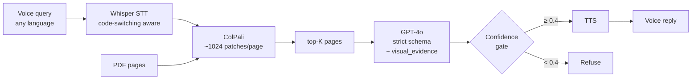

# S3 Multimodal Lab — Visual RAG · Voice · Video

[](https://github.com/zyziyun/s3-multimodal-lab/actions/workflows/sanity.yml)
[](LICENSE)
[](notebooks)
[](#notebooks)

> **A production-grade, step-by-step lab for modern multimodal AI.** 12 Jupyter notebooks that walk you from "how does a VLM see an image?" all the way to a voice-driven Visual RAG agent that chats with chart-heavy PDFs in Chinese, English, or both.

## What you'll build



Every defensive design choice — strict schema, visual-evidence grounding, confidence gates, VAD chunking, glossary biasing, RRF fusion — is motivated, implemented, **and tested**.

## Highlights

- **No OCR**: ColPali treats each PDF page as an image, keeps all ~1024 patch vectors per page, and uses MaxSim late interaction so query tokens match *specific* chart bars / table cells / figure captions. The 2024–2025 paradigm shift in document RAG.
- **Chinese ↔ English code-switching**: dedicated notebook with a 5-sample eval set, two metrics (CER + English-word recall), and three measured mitigation strategies (force language + glossary biasing, VAD chunking, vanilla).
- **Real voice agent**: faster-whisper → GPT-4o (with tool calls) → OpenAI TTS, both sync and streaming. Plus a side-by-side **GPT-4o Realtime** comparison so you can hear the prosody gap.
- **Dual-index video search**: ffmpeg → CLIP frames + Whisper segments → Reciprocal Rank Fusion. Searches a YouTube / B站 lecture by natural language, returns timestamps. Compared head-to-head against Gemini long-context native video.
- **Engineered, not just demoed**: a `s3lab/` package with the canonical pure-Python utilities, 95 pytest sanity assertions running in CI, and a per-phase `evals/` harness with ground truth + pass/fail thresholds.

## Why this lab exists

Traditional RAG over PDFs goes `parse → OCR → chunk → embed → search`. That pipeline destroys charts, tables, equations, figures — exactly the parts of a technical document that carry the most information.

**ColPali** (Faysse et al., 2024) treats each page as an image, produces ~1024 patch embeddings per page, and uses **late interaction (MaxSim)** to score query tokens against page patches. Every query token finds its best-matching patch. Visual structure is preserved.

## Notebooks

Run them in order. Each one stands alone but builds on the previous concept.

| # | Notebook | What you'll learn | Maps to S3 § |
|---|----------|-------------------|--------------|
| 01 | [How VLMs See Images](notebooks/01_how_vlms_see_images.ipynb) | Image tokens, GPT-4o cost math, why resolution matters | §1.3, §2 |
| 02 | [CLIP Text→Image Search](notebooks/02_clip_text_to_image_search.ipynb) | Multimodal embeddings, contrastive learning, the modality gap | §4.1, §4.2 |
| 03 | [ColPali Visual RAG](notebooks/03_colpali_visual_rag.ipynb) | Late interaction, MaxSim, end-to-end visual document RAG | §4.3, §5.3 |
| 04 | [Grounded Generation](notebooks/04_grounded_generation.ipynb) | Strict schema, visual evidence, hallucination mitigation | §7 |
| 05 | [Multilingual Visual RAG](notebooks/05_multilingual_visual_rag.ipynb) | Why ColPali beats OCR on Chinese/Japanese PDFs | §4.3 |
| 06 | [Whisper Basics](notebooks/06_whisper_basics.ipynb) | Multilingual STT with faster-whisper, word timestamps | §6.3 |
| 07 | [Code-Switching Deep Dive](notebooks/07_codeswitching.ipynb) | Mixed Chinese/English speech: failure modes & fixes | §6.3 |
| 08 | [Voice Agent](notebooks/08_voice_agent.ipynb) | Sequential STT→LLM→TTS pipeline + latency budget | §6.1, §6.2 |
| 09 | [Video Indexing](notebooks/09_video_indexing.ipynb) | Frame + audio dual index over YouTube/B站 talks | §8.1 |
| 10 | [Native vs DIY Video](notebooks/10_video_native_compare.ipynb) | Gemini long-context vs frame-sampling pipeline | §8.2 |
| 11 | [Speech-to-Speech](notebooks/11_speech_to_speech.ipynb) | GPT-4o Realtime vs sequential pipeline (nb08) | §6.4 |
| 12 | [Capstone Agent](notebooks/12_capstone_agent.ipynb) | Voice-driven Visual RAG: Whisper → ColPali → grounded → TTS | end-to-end |

## Setup

### 1. Clone & install

```bash
git clone <this-repo>
cd s3-multimodal-lab
python -m venv .venv && source .venv/bin/activate
pip install -r requirements.txt
```

### 2. System dependencies

`pdf2image` needs `poppler`. Notebook 05 also needs `tesseract` with Chinese & Japanese language packs for the OCR baseline.

```bash
# macOS
brew install poppler tesseract tesseract-lang ffmpeg

# Ubuntu/Debian
sudo apt-get install -y poppler-utils tesseract-ocr tesseract-ocr-chi-sim tesseract-ocr-jpn ffmpeg
```

`ffmpeg` is needed for nb09 / nb10 (video frame + audio extraction).

### 3. API keys

```bash
cp .env.example .env
# Edit .env and add your OpenAI API key
```

### 4. Sample PDFs

Drop any PDF you want to chat with into `data/sample_pdfs/`. A chart-heavy one (financial report, paper with figures, technical slide deck) shows ColPali's strengths most clearly.

## Sanity tests

Pure-Python utilities used across the notebooks (image-token math, text
normalization, MaxSim, RRF) are extracted into the `s3lab/` package and
covered by a fast pytest suite. CI runs them on every push.

```bash
pip install pytest numpy
pytest
```

The suite also validates that every notebook is parseable JSON, starts
with an H1, has at least one code cell, and has no committed outputs
(outputs bloat diffs and leak data). It does **not** require API keys
or GPU — runs in well under a second.

## Eval suite

For *quality* regression testing (slower, needs the heavy models), see
[`evals/README.md`](evals/README.md). One self-contained eval (Phase 3
code-switching) runs end-to-end with just `OPENAI_API_KEY`; the others
are templates that point at your own PDF / video.

```bash
python evals/phase3_codeswitch/run.py    # ~3 minutes, prints + saves report
python evals/run_all.py                  # everything available
```

## Hardware notes

- **Notebooks 01, 02, 04** run fine on CPU.
- **Notebook 03 (ColPali)** is memory-heavy. Recommended:
  - macOS: Apple Silicon with ≥16 GB RAM (uses MPS backend)
  - Linux: NVIDIA GPU with ≥10 GB VRAM
  - Or run on Google Colab with T4/A100

If ColPali is too heavy for your setup, the notebook includes a simpler CLIP-based fallback so you still get the end-to-end story.

## What you'll have built at the end

A working Visual RAG service that:
- Indexes PDFs as images (no OCR)
- Retrieves the right page for any question — including questions about specific chart bars or table cells
- Generates answers grounded in the retrieved page, with a strict JSON schema and visual-evidence citations to suppress hallucination
- Logs token usage so you can reason about cost in production

Résumé-quality work.

## References

- [ColPali paper (Faysse et al., 2024)](https://arxiv.org/abs/2407.01449)
- [Hugging Face — VLMs in 2025 overview](https://huggingface.co/blog/vlms-2025)
- [OpenAI Images and Vision guide](https://platform.openai.com/docs/guides/images-vision)
- [Vidore ColPali model card](https://huggingface.co/vidore/colpali-v1.3-hf)
